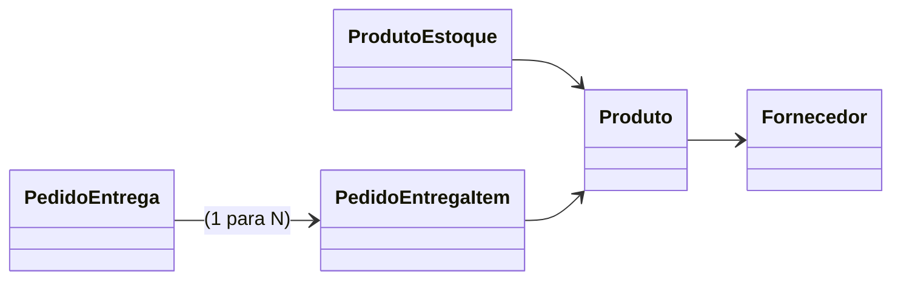
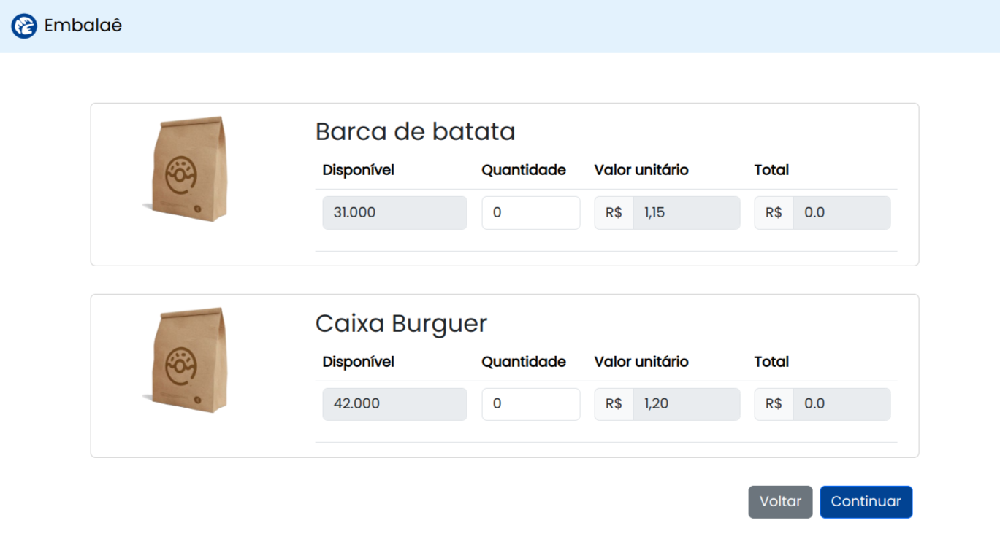

# 🏆 Bem-vindo ao teste do Embalae

## Contexto

Um delivery de hamburguer quer fazer pedido de embalagens para uma gráfica. Por exemplo, 500 Caixas médias para batata frita.
Estamos fornecendo um projeto inicial (Django) com alguns modelos inciais:



### Estrutura de pastas

Visao geral

```shell
testembalae                   👉 Pasta raiz do projeto
 └── testembalae              👉 base do projeto
    ├── accounts              👉 app de usuário (não relevante)
    ├── core                  👉 app principal onde deve ter a lógica de delivery
    └── testembalae
        ├── settings.py
        ├── urls.py
        └── wsgi.py
```


## Requisitos

- Git
- 🐍 Python 3.9.x ou 3.11.x (para utilizar Poetry)
- Sem Docker 📦: Apenas **Python** (usando sqlite)
- Com Docker 🐋 Docker: Docker e Docker compose para subir Postgres
- Ver .env para escolher com/sem docker
- Rodar createsuperuser para acessar o admin
- Carregar as fixtures para ter um cadastro inicial
- Ver o endpoint http://localhost:8000/api/core/estoque/produtos

```json
{
  "produtos": [
    {
      "id": 1,
      "produto": {
        "id": 1,
        "nome": "Caixa média para hamburguer",
        "unidade": "UN",
        "quantidade_minima": 42,
        "descricao": "Caixa 15x6x8",
        "imagem": "https://embalae-dev-bucket-static.s3.sa-east-1.amazonaws.com/static/estoque/images/embalagem_840x520.png"
      },
      "lote": "1",
      "quantidade_disponivel": 1000
    },
    {
      "id": 2,
      "produto": {
        "id": 2,
        "nome": "Caixa para batata",
        "unidade": "UN",
        "quantidade_minima": 42,
        "descricao": "",
        "imagem": "https://embalae-dev-bucket-static.s3.sa-east-1.amazonaws.com/static/estoque/images/embalagem_840x520.png"
      },
      "lote": "2",
      "quantidade_disponivel": 2000
    }
  ]
}
```

## Desafio

- Implementar a página para fazer o **Pedido de Produtos para entrega**, ou seja, o Delivery precisa pedir Embalagens.
- É um desafio Full-stack, mas estamos esperando que o candidato gaste mais energia no **FRONTEND**
- **OPÇÃO 1**: Pode utilizar django templates e implementar a página utilizando a forma tradicional do django (urls, views, forms) e um bootrsap para não perder muito tempo com CSS. Neste caso, pode mudar a view para ao invés de retornar o JSON (acima), retornar a lista de modelos diretamento no contexto (Na forma padrão do Django)
- **OPÇÃO 2**: Pode utilizar o django apenas como backend (API) e fazer o **FRONTEND** separado no estilo [D-Jà Vue](https://www.djavue.org/), ou seja, o projeto pode estar na pasta frontend, rodar de forma independente, ter seu gestor de dependências etc...



## IMPORTANTE
- Não precisa ter o estilo exato como a imagem acima. Fique à vontade para escolher uma biblioteca visual que você se sente confortável e desenvolve mais rápido.
- A imagem acima é um GUIA, o importante é focar nas regras de negócio a seguir

## REGRAS

- Exibir os produtos da tabela **ProdutoEstoque** que possuem `quantidade_disponivel > 0`
- Não permitir efetuar um pedido com quantidade maior que o valor do `quantidade_disponivel`
- O valor total do pedido NÃO pode ser menor que `Fornecedor.valor_pedido_minimo`
- O pedido deverá gerar 1 registro na tabela `PedidoEntrega` e 1 registro para cada item na tabela `PedidoEntregaIte`

## O QUE SERÁ AVALIADO

- Organização do código
- Breve explicação das escolhas
- Breve explicação de como devemos executar o projeto para testá-lo
